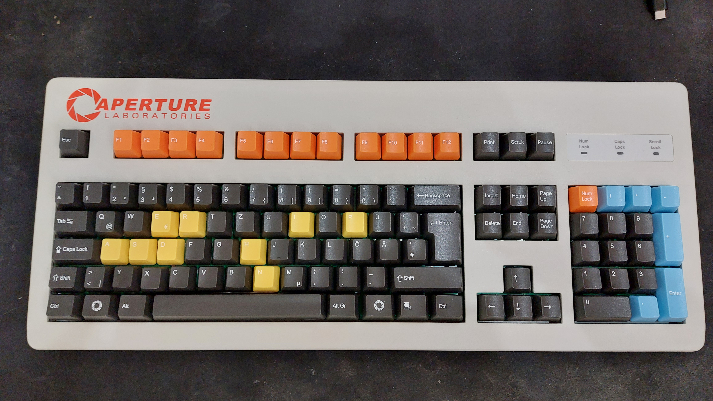
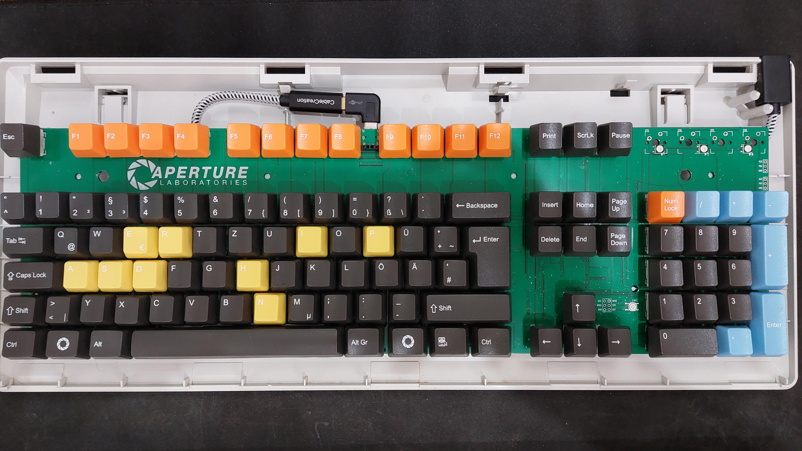
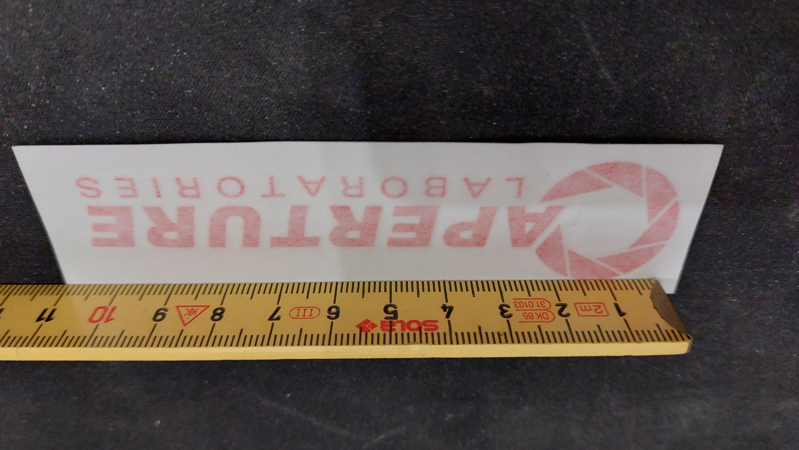
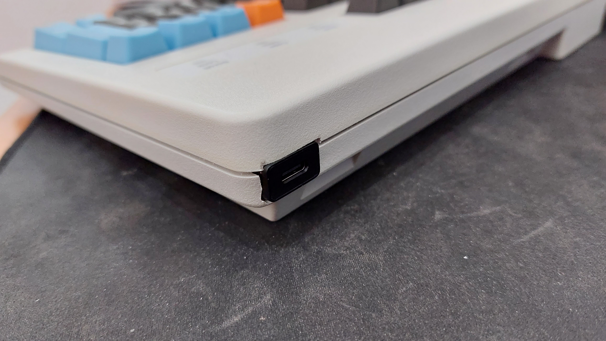

# Aperture Keyboard
Instructions and resources for how to build the Aperture Keyboard

## Table of Contents
- [Case](#case)
- [Switches](#switches)
- [Keycaps](#keycaps)
- [Stabs](#stabs)
- [PCB](#pcb)
- [Firmware](#firmware)
- [Stickers](#stickers)
- [USB-C Port](#usb-c-port)

## Case
Get a second hand Cherry G80-3000 or any G80-3xxx. Make sure to get a decently non-yellowed one.

> **Watch out!!** Most Cherry G80-3000 come with a logo printed on the top left (where the aperture logo is supposed to be). I couldn't find a way to remove it without damaging the case. Some models don't have it, but most do. If you want to avoid this, try to find one without the logo (I had to get a second one because of this).

My first case (With logo) cost 40€, my second one (Without logo) cost 60€. I think it's worth it to get a non-yellowed one, but it's up to you.

## Switches
You can use any MX switches. My G80-3000 came with Cherry MX Blues which are very clacky, so I got Boba U4 Silent Tactile Switches, but feel free to use whatever you like.

This keyboard is definitely not hotswap lol. This project was the first time I properly soldiered something and it wasn't too hard.

I got my switches for 94€, including shipping.

## Keycaps
I ordered mine on [wasdkeyboards.com](https://www.wasdkeyboards.com/). My keyboard uses the ISO layout, but you can also choose ANSI. Color the keys accordingly. The gray caps on my keyboard use the darkest gray color, not black. 
A design for a german ISO layout can be found [here](wasd-inkscape-105-04.20.2021.svg). My design is a standard layout downloadable at wasdkeyboards.com with an extra Aperture logo in place of a windows key.

The caps cost me 89€, including shipping

## Stabs
The Cherry G80-3000 already has stabalizers. I didn't get any custom ones, they were good enough.

## PCB
My standard G80-3000 PCB had a few problems, which is why I printed my own.

- The space bar switch on the G80-3000 isn't positioned in the middle, but 1u to the left. wasdkeyboards.com only ships space caps with centered stem slots
- The caps lock switch on the G80-3000 is offset to the left, but wasdkeyboards.com only ships caps lock caps with centered stem slots
- No ability to upload custom firmware
- G80-3000 PCB seems to often lag / lock if key presses are entered too quickly. Kind of a random thing but it happens often enough to become frustrating after a bit
- The stock PCB comes with a long PS2 plug. My PC actually has a PS2 slot but USB is always nicer. I also wanted to add a port right into the case instead of having a long cable constantly attached
- The stock PCB extends slightly on the top and bottom, making it significantly harder to reassemble the case

**The PCB design will be uploaded shortly after I made some adjustments to the design**

The PCB has a reset switch placed right where the case will press against it. Use a file to make a little hole. Don't worry, you can't see it even if you're looking for it

### PCB Parts and assembly
Not going to list all parts here as you can look them up on the design. The PCB uses an Atmega AT32u4 microcontroller, which is by far the most expensive component. It cost me around 40€.
JLCPCB requires you to order at least 2 fully assembled PCB, which means you will spend quite a buck. I paid 213€, including shipping, for 2 fully assembled boards and 3 empty PCBs without any components and only copper. Yes I now have 4 boards just lying around.

Once you get the PCB be prepared to soldier all 10(4|5) switches. Honestly it sounds harder than it is.

## Firmware
The PCB requires custom firmware to run. You can find my QMK firmware on my [fork here](https://github.com/StefanH-AT/qmk_firmware). (Called GA80-3000 as in G Aperture 80-3000) I might see if I can merge to upstream.

The firmware is free :) Open source software is great, thank you QMK ❤!

### Firmware flashing
The firmware is easy to flash as the microcontroller already comes with a bootloader. The QMK toolkit should do the job, if not, PCB Editor can definitely do it.

### Firmware oddities
My firmware uses QMK's RGB lighting api to control the 3 status leds. If you ever intend to add full RGB to your keyboard, you will have to significantly modify the firmware. Good luck!

Also I unbound the Menu key to act as a function key. If you like that change, consider printing a function key cap. If you rather have a menu key you can just modify the firmware and remove the macro.

## Stickers
I got my logo sticker from [this etsy store](https://www.etsy.com/listing/1068475395/aperture-laboratories-vinyl-decal). It cost me 8€, including shipping. 

> **Watch out!!** This store's logos are 3.8cm (1.5 inches) tall, which is way too big for the case! I made a special request to scale the logo to be 2.5cm (1 inch) tall. The seller was super cooperative and made the logo for me. If you want to get a logo from this store, make sure to specify the size you want. In hindsight even 2.5cm is a bit big, but I'm happy with it.

Applying the vinyl sticker was very easy. Rub the surface with some alcohol and then apply the sticker. The sticker is very thin and doesn't leave any residue.

## USB-C Port
The Cherry G80-3000 comes with a long PS2 cable that cannot be removed. I wanted to add a USB-C port to the case. The PCB has a USB-C port, but I wanted to have a port at the exterior of the case as well.

Here's the picture again of what I ended up doing.

It would probably be cheaper to just buy a USB-C port and solder it to the PCB, but I wanted to have a port on the exterior of the case as well. I also wanted to have a port that can be removed from the case, so I can use the keyboard without the case.

The USC-C port I used is a [CableCreation USB-C extendor cable](https://www.amazon.de/Verl%C3%A4ngerung-CabelCreation-SuperSpeed-Extender-Stecker/dp/B01FM4ZQLQ/ref=sr_1_3?__mk_de_DE=%C3%85M%C3%85%C5%BD%C3%95%C3%91&crid=7JYLWJ8P2CH1&keywords=cablecreation+usb+c+extender&qid=1668271018&sprefix=cablecreation+usb+c+extender%2Caps%2C95&sr=8-3). I bought it because I liked the bug stirty metal housing. It cost me 8e, including shipping. It also conveniently fits PERFECTLY into the little cable nook on the top right of the case. I had to use a file to make the hole a bit bigger, but it fits perfectly now without requiring any glue or tape to hold it in place. One downside with this cable is that it is very thick and hard to bend. A thinner cable would be better, but so far I've not had any connection problems or the like. If you wish to rebuild this keyboard, this is definitely something to consider.

## License

### Instructions
You may follow the instructions to replicate the keyboard for yourself. If you modify and republish these instructions, please note that the design was originally inspired by these instructions.

### PCB
The PCB's original design, created by farmakon and published [here on geekhack.org](https://geekhack.org/index.php?topic=92962.0) is licensed under Creative Commons. 
The design has been modified under the same license by [Raldone01](https://github.com/raldone01)

### Images
The Aperture Science logos are owned by Valve Software. Please rech out to them for any questions about commercializing their design

The photos are mine, don't use them
